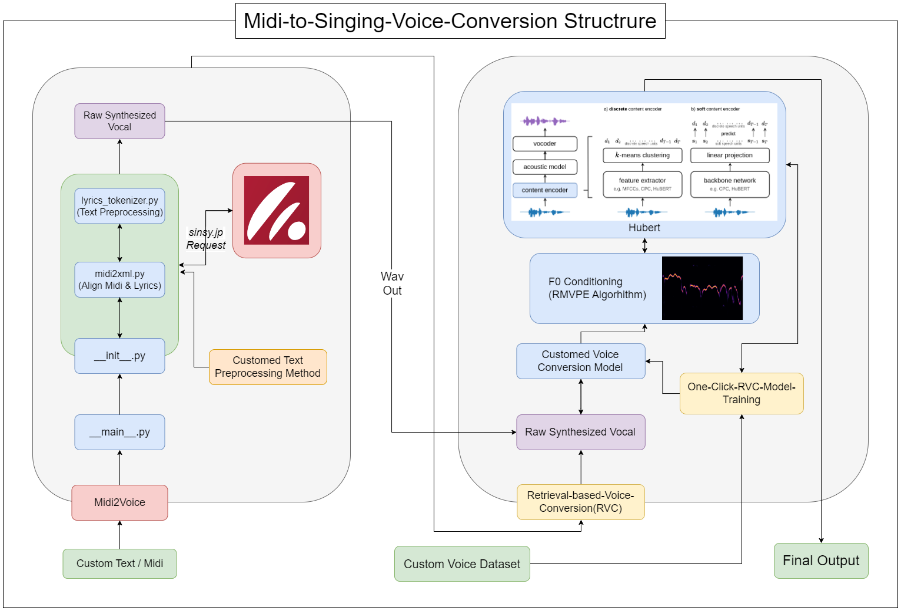

- # Midi-to-Singing-Voice-Conversion(M2SVC)


Vocal Synthesis Through MIDI and Vocal Transformation Using RVC: Exploration of Innovative Music Processing Methodologies


## Contents 
- [Model Structure](#structure)
- [Prerequisites](#prerequisites)
- [Installation](#installation)
- [Prepare_Datasets](#prepare_datasets)
- [Usage](#usage)
- [To-do](#to-do)
- [References](#references)

## Structure


## Prerequisites
- A Windows/Linux system with a minimum of `16GB` RAM.
- A GPU with at least `12GB` of VRAM.
- Python = 3.8
- Anaconda installed.
- PyTorch installed.
- CUDA 11.x installed.
- Musescore 3 installed.

Pytorch install command:
```sh
pip install torch==1.13.1+cu117 torchvision==0.14.1+cu117 torchaudio==0.13.1 --extra-index-url https://download.pytorch.org/whl/cu117
```

[CUDA 11.7 install](https://developer.nvidia.com/cuda-11-7-0-download-archive)

[Musescore 3 install](https://ftp.osuosl.org/pub/musescore-nightlies/windows/3x/stable/)

**Musescore 3 must be set as an environment variable.**

---

## Installation 
1. **Create an Anaconda environment:**

```sh
conda create -n m2svc python=3.8
```

2. **Activate the environment:**

```sh
conda activate m2svc
```

3. **Clone this repository to your local machine:**

```sh
git clone https://github.com/ORI-Muchim/Midi-to-Singing-Voice-Conversion.git
```

4. **Navigate to the cloned directory:**

```sh
cd Midi-to-Singing-Voice-Conversion
```

5. **Extract the [RVC.zip](https://drive.google.com/file/d/1GLrGqm05OagxFsuwNPTfa0WlgT55gofb/view?usp=sharing) file and move the folder to this directory.**

6. **Install the necessary dependencies:**

```sh
pip install -r requirements.txt
```

---

## Prepare_Datasets

Place the audio files as follows. 

```
Midi-to-Singing-Voice-Conversion
├────datasets
│    └───kss
│        ├───4_5132.wav
│        ├───4_5133.wav
│        └───4_5134.wav
│
├────inputs
│    ├───cin.mid
│    ├───cin.txt
│    ├───shallow_base.wav
│    ├───shallow.mid
│    └───shallow.txt
│
├────midi2voice
│    ├───__init__.py
│    ├───__main__.py
│    ├───lyrics_tokenizer.py
│    ├───midi2xml.py
│    └───README.md
│
├────RVC
│    └───...
│
├────src
│    └───M2SVC_Flowgraph.png
│
├────final_vocal.wav
├────ko2kana.py
├────main.py
├────Readme.md
├────requirements.txt
├────voice.wav(Raw-Synthesized-Voice)
└────voice.xml
```

Please put the audio data of Voice Conversation through RVC in `./datasets` and txt and mid files to be synthesized with midi2voice in `./inputs` folder.

---

## Usage

To start this tool, use the following command, replacing your respective values {language: ko, ja, en, zh} / {gender: female / male(Recommend: female)}:

```sh
python main.py {model_name} {text_file} {midi_file} {language} {gender} {bpm}
```

---

## To-do

- Automatic Pitch Analyzer (UVR -> VOCAL (INST REMOVED) -> RMVPE -> MIDI) / Work In Process!
- Japanese Kanji to Katakana Cleaner / Work In Process

---

## References

For more information, please refer to the following repositories: 
- [mathigatti/midi2voice](https://github.com/mathigatti/midi2voice)
- [RVC-Project/Retrieval-based-Voice-Conversion-WebUI](https://github.com/RVC-Project/Retrieval-based-Voice-Conversion-WebUI)
- [Kyubyong/g2pK](https://github.com/Kyubyong/g2pK)
- [kdrkdrkdr/ko2kana](https://github.com/kdrkdrkdr/ko2kana)